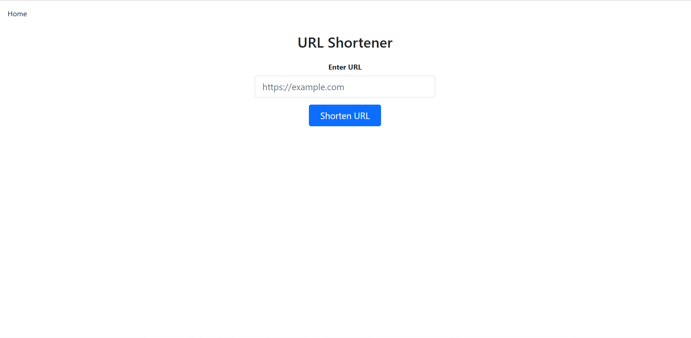
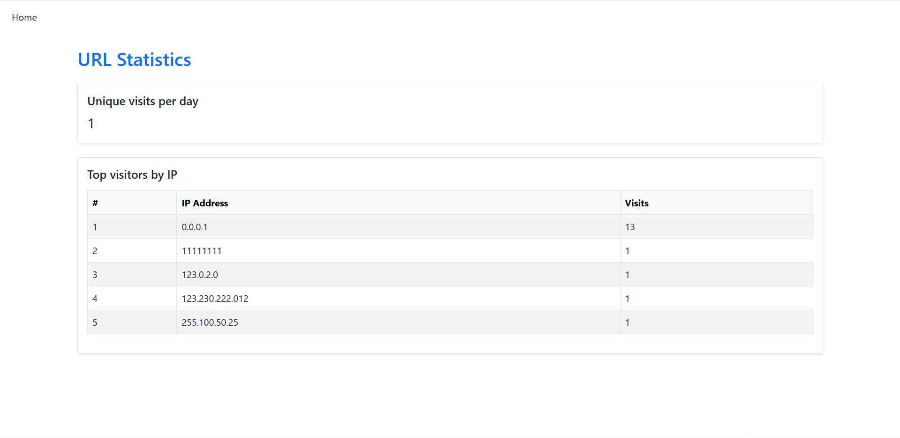
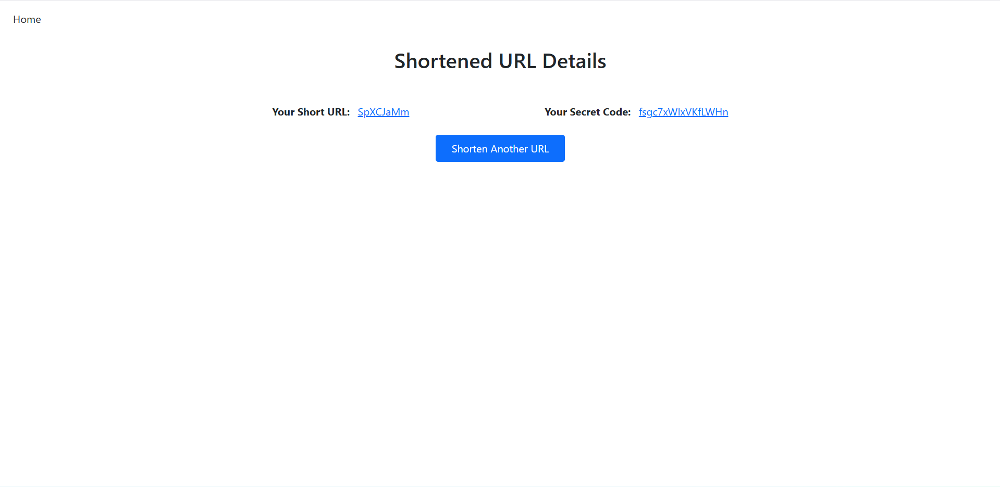

# URL Shortener Web Application

## Overview
This web application allows users to shorten long URLs. Each shortened link automatically tracks visits, including client IP addresses, and provides a private secret stats page. The stats page displays unique daily visits and the top 10 IPs by access count.

## Features
- Shorten long URLs into easy-to-share links  
- Generate a secret stats URL for each short link  
- Track visits by client IP
- Unique daily visit tracking  
- Top 10 IPs ranked by number of visits  

## Tech Stack
- **.NET 8**
- **ASP.NET Core MVC**
- **Entity Framework Core**
- **MS SQL Server**
- **Bootstrap** 
- **Toastr.js**

## Get Started

### Prerequisites
- .NET 8 SDK  
- SQL Server (local installation or Docker)

### Setup Instructions

1. **Clone the Project:**
   - Clone the project from the following GitHub repository [Url Shortener](https://github.com/AntonTodorov321/URL-Shortener)
     
2. **Database Setup**
   - Open the `appsettings.json` file.  
   - Update the `DefaultConnection` string to point to your SQL Server instance.
   - Apply EF Core migrations using one of the following options:


    **Option 1** Using .NET CLI (Bash/Command Prompt)
   ```bash
   dotnet ef database update
   ```
   
    **Option 2** Using Package Manager Console (PMC) in Visual Studio
     ```powershell
     Update-Database
     ```

3. **Run the Application**
   
   **Option 1**
   In Visual Studio, press **Ctrl + F5** to start the application.

   **Option 2** Using .NET CLI
   ```bash
   dotnet run
   ```
   

5. **Enjoy the app 🎉**
   - Enter a long URL on the home screen to generate a short link.  
   - Use the secret stats URL to view usage analytics.
  
## Screenshots

### Home Page


### Stats Page


### Shortener Page

